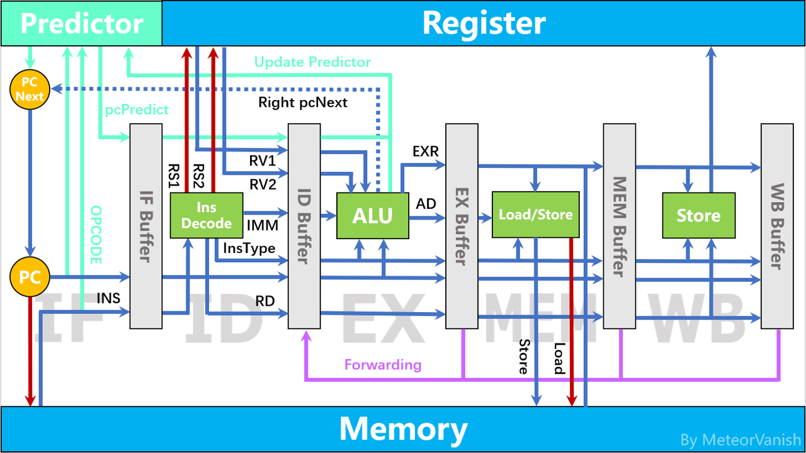

# RISC-V Simulator

## 简介

- 上海交通大学，2021级CS，MeteorVanish
- 2021-2022学年夏季学期，PPCA Project 1
- 用 C++ 模拟 CPU 五级流水，使用 `RISC-V` 指令集

## 实现成果

- 各阶段可乱序执行（模拟硬件并行）
- 通过 `Forwarding` 尽量避免 `Stall`，减少时钟周期
- 采用混合分支预测，平均准确率为 `80.94%`（详见后文各测试点预测准确率）

## 五级流水

### 架构设计图

### 各阶段说明

- `IF (Instruction Fetch)`
    - 消耗一个时钟周期
    - 内存中读取指令，分支预测
- `ID (Instruction Decode)`
    - 消耗一个时钟周期
    - 指令解码，读取寄存器
- `EX (EXecute)`
    - 消耗一个时钟周期
    - 获取计算结果、目标内存地址（Load/Store）、下条指令地址（Jump/Branch），更新预测器
- `MEM (MEMory access)`
    - `Load/Store` 指令消耗三个时钟周期，其余消耗一个时钟周期
    - 写入/读取内存地址（Load/Store）
- `WB (Write Back)`
    - 消耗一个时钟周期
    - 写入寄存器

### 缩写说明

| **缩写** | **全称** | **含义** |
|:------:|:--------------------:|:--------:|
| PC     | Program Counter      | 指令地址      |
| INS    | Instuction           | 指令         |
| OPCODE | Operation Code       | 指令操作码     |
| IMM    | Immediate            | 立即数        |
| RS     | Register Source      | 来源寄存器编号  |
| RV     | Register Value       | 来源寄存器的值  |
| RD     | Register Destination | 目标寄存器编号  |
| AD     | Address Destination  | 目标地址      |
| EXR    | Execution Result     | 计算结果      |

## 问题及解决方案

- `Data Hazard`
    - **问题：** 当前指令的 `rs` 是前三条指令的 `rd` （尚未将新值写入寄存器）
    - **解决方案：** **Forwarding**，即将之前指令计算后存在对应 `Buffer` 中的值复制到当前指令的 `Buffer` 中
    - **问题：** 当前指令的 `rs` 是上条指令（Load）的 `rd` （尚未从内存中读取寄存器的值）
    - **解决方案：** **Stall**，即将 `IF、ID、EX` 暂停一个时钟周期，对应 `Buffer` 的值保留
- `Control Hazard`
    - **问题：** 分支预测结果错误
    - **解决方案：** **Discard**，即将 `IF/ID.Buffer` 中的值清空，更新下条指令地址

## 文件结构

- **main.cpp**
    - `main` 函数
- **CPU.hpp**
    - `CPU` 类
        - **成员变量**
            - 内存对象、寄存器对象、预测器对象、五阶段对象、五阶段 `Buffer`、`pc`、`pcNext`、各种 `Flag/Cnt`
        - **成员函数**
            - `run()`：模拟时钟周期乱序执行五阶段（模拟五阶段并行）
- **Stage.hpp**
    - `stageIF/ID/EX/MEM/WB` 类
        - **成员变量**
            - `Buffer`、`NOPFlag`以及一些CPU成员变量的引用
        - **成员函数**
            - `execute()`：执行各阶段功能，得到 `Buffer` 数据
- **Memory.hpp**
    - `Memory` 类
        - **成员变量**
            - `Data[]`
                - 每一位存1 Byte的数据的数组
        - **成员函数**
            - `构造函数`：读取输入数据存入 `Data` 中
            - `Load()`：读取 `pos` 开始 `len` 个Byte的数据
            - `Store()`：将 `val` 写入 `pos` 开始 `len` 个Byte中
- **Register.hpp**
    - `RegTable`
        - `RISC-V` 寄存器名称表
    - `Register` 类
        - **成员变量**
            - `Data[32]`
                - 32个32位寄存器
        - **成员函数**
            - `Load()`：读取第 `index` 个寄存器的数据
            - `Store()`：将 `val` 写入第 `index` 个寄存器中（特判zero寄存器不可修改）
- **Buffer.hpp**
    - `IF/ID/EX/MEM/WB_Buffer` 结构体
        - **成员变量**
            - 对应阶段需保存的数据（确保可以乱序执行）
        - **成员函数**
            - `Clear()`：清空 `Buffer`
- **Predictor.hpp**
    - `Predictor` 类
        - **成员变量**
            - `TotalNum`,`CorrectNum`
                - 用于记录预测准确率
            - `Counter[]`
                - 记录指令的预测次数，用于决策预测方法
            - `BTB[]`
                - Branch Target Buffer，记录跳转地址
            - `BHT[]`
                - Branch History Table，记录历史跳转模式
            - `PHT[][]`
                - Pattern History Table，每条指令特定模式的四位饱和计数器
            - `TwoBitCounter[]`
                - 每条指令简单的四位饱和计数器
        - **成员函数**
            - `构造函数`：初始化将所有四位饱和设置为 `not taken` 情况下的最大值，将 `BTB[]` 设置为对应 `pc` 地址+4
            - `NextPredict()`：预测下条指令地址，修改 `pcNext` 和 `pcPredict` 的值
            - `Update()`：根据 `EX` 阶段得到的跳转地址更新预测器
            - `PrintResult()`：用于输出预测准确率
- **Instruction.hpp**
    - `InsTable`
        - `RISC-V` 指令名称表
    - `enum INS_TYPE`
        - `RISC-V` 指令名称枚举
    - `Is___()`
        - 指令类型判断
    - `SignExtend()`
        - 指令符号位扩展
    - `InsDecode()`
        - 指令解码，获得 `InsType`，`rd`，`imm`，`rs1`，`rs2`，`RegNum`
- **LocalTest.hpp**
    - 在OJ上评测时注释 `CPU.hpp` 中的 `#include "LocalTest.h"` 即可 `AC`
    - `#define RISC_V_DEBUG`
        - 取消注释会打印每个测试点每个时钟周期结束后寄存器与 `Buffer` 中的数据
    - `#define RISC_V_PRINT`
        - 取消注释会打印每个测试点总时钟周期、分支预测总数、正确数和准确率
    - `FileTable`
        - 测试点文件名称表
    - `AnsTable`
        - 测试点答案表

## 分支预测

### 具体方法

在 `IF` 阶段以 `pc` 为依据进行分支预测，在 `EX` 阶段根据跳转结果更新分支预测器

- **四位饱和计数器预测**
    - **实现：**
        - `IF`：通过 `BTB[]` 获得分支跳转地址，通过 `FourBitCounter[]` 判断是否跳转
        - `EX`：第一次跳转时更新 `BTB[]`，每次更新 `FourBitCounter[]`
- **二级自适应预测**
    - **实现：**
        - `IF`：通过 `BTB[]` 获得分支跳转地址，通过 `BHT[]` 获得历史跳转模式，通过 `PHT[][]` 判断是否跳转
        - `EX`：第一次跳转时更新 `BTB[]`，每次更新 `BHT[]` 和对应的 `PHT[][]`
- **混合分支预测**
    - **思路：** 二级自适应预测能够对不同的历史跳转模式记录饱和计数器，这在预测数多的情况下，能记录更多的历史跳转信息，相比饱和计数器预测更有针对性， 准确率占优势，但在预测数较少的情况下，每种模式第一次跳转都将预测失败，反而导致准确率降低，因此选择一条标准线，对每条指令而言，预测数量超过标准线 后再采用二级自适应预测，否则采用四位饱和计数器预测，这样兼顾了前两种预测方法的优点，综合预测准确率有一定的提升。
    - **实现：**
        - `IF`：当 `Counter[]` 大于 `SWITCH_THRESHOLD` 时采用二级自适应预测，否则采取四位饱和计数器预测
        - `EX`：第一次跳转时更新 `BTB[]`，每次更新 `Counter[]`，并同时更新 `FourBitCounter[]` 和 `BHT[]`，`PHT[][]`

### 预测准确率

- **静态预测（始终跳转）**（平均预测准确率：`55.29%`）

| **测试点** | **时钟周期数** | **预测准确率** | **预测正确数** | **预测总数** |
|:--------------:|:---------:|:---------:|:---------:|:--------:|
| array_test1    | 311       | 54.55%    | 12        | 22       |
| array_test2    | 367       | 50.00%    | 13        | 26       |
| basicopt1      | 798333    | 58.98%    | 91497     | 155139   |
| bulgarian      | 733162    | 50.64%    | 36204     | 71493    |
| expr           | 716       | 37.84%    | 42        | 111      |
| gcd            | 695       | 62.50%    | 75        | 120      |
| hanoi          | 372674    | 49.98%    | 8725      | 17457    |
| lvalue2        | 74        | 66.67%    | 4         | 6        |
| magic          | 1015604   | 53.14%    | 36068     | 67869    |
| manyarguments  | 84        | 80.00%    | 8         | 10       |
| multiarray     | 2893      | 18.52%    | 30        | 162      |
| naive          | 42        | /         | 0         | 0        |
| pi             | 154175873 | 42.27%    | 16889646  | 39956380 |
| qsort          | 2610408   | 30.01%    | 60027     | 200045   |
| queens         | 1098170   | 63.22%    | 48754     | 77116    |
| statement_test | 1572      | 59.41%    | 120       | 202      |
| superloop      | 642595    | 87.29%    | 379755    | 435027   |
| tak            | 3152987   | 75.00%    | 45479     | 60639    |

- **四位饱和计数器预测**（平均预测准确率：`75.44%`）

| **测试点** | **时钟周期数** | **预测准确率** | **预测正确数** | **预测总数** |
|:--------------:|:---------:|:---------:|:---------:|:--------:|
| array_test1    | 299       | 54.55%    | 12        | 22       |
| array_test2    | 351       | 57.69%    | 15        | 26       |
| basicopt1      | 664485    | 82.98%    | 128727    | 155139   |
| bulgarian      | 641530    | 93.77%    | 67041     | 71493    |
| expr           | 614       | 83.78%    | 93        | 111      |
| gcd            | 629       | 68.33%    | 82        | 120      |
| hanoi          | 351242    | 73.35%    | 12805     | 17457    |
| lvalue2        | 74        | 66.67%    | 4         | 6        |
| magic          | 936056    | 81.00%    | 54971     | 67869    |
| manyarguments  | 88        | 60.00%    | 6         | 10       |
| multiarray     | 2599      | 83.33%    | 135       | 162      |
| naive          | 42        | /         | 0         | 0        |
| pi             | 117739039 | 83.64%    | 33418674  | 39956380 |
| qsort          | 2244586   | 89.07%    | 178189    | 200045   |
| queens         | 1045312   | 75.99%    | 58599     | 77116    |
| statement_test | 1460      | 61.39%    | 124       | 202      |
| superloop      | 579101    | 92.28%    | 401458    | 435027   |
| tak            | 2971489   | 74.68%    | 45286     | 60639    |

- **二级自适应预测**（平均预测准确率：`76.87%`）

| **测试点** | **时钟周期数** | **预测准确率** | **预测正确数** | **预测总数** |
|:--------------:|:---------:|:---------:|:---------:|:--------:|
| array_test1    | 299       | 54.55%    | 12        | 22       |
| array_test2    | 355       | 50.00%    | 13        | 26       |
| basicopt1      | 613743    | 99.33%    | 154098    | 155139   |
| bulgarian      | 640080    | 94.79%    | 67766     | 71493    |
| expr           | 660       | 63.06%    | 70        | 111      |
| gcd            | 645       | 61.67%    | 74        | 120      |
| hanoi          | 342530    | 98.30%    | 17161     | 17457    |
| lvalue2        | 74        | 66.67%    | 4         | 6        |
| magic          | 928756    | 86.37%    | 58621     | 67869    |
| manyarguments  | 84        | 80.00%    | 8         | 10       |
| multiarray     | 2731      | 42.59%    | 69        | 162      |
| naive          | 42        | /         | 0         | 0        |
| pi             | 117608981 | 83.80%    | 33483703  | 39956380 |
| qsort          | 2213370   | 96.88%    | 193797    | 200045   |
| queens         | 1034246   | 83.16%    | 64132     | 77116    |
| statement_test | 1460      | 61.39%    | 124       | 202      |
| superloop      | 518797    | 99.21%    | 431610    | 435027   |
| tak            | 2959051   | 84.94%    | 51505     | 60639    |

- **混合分支预测**（平均预测准确率：`80.94%`）

| **测试点** | **时钟周期数** | **预测准确率** | **预测正确数** | **预测总数** |
|:--------------:|:---------:|:---------:|:---------:|:---------:|
| array_test1    | 299       | 54.55%    | 12        | 22        |
| array_test2    | 351       | 57.69%    | 15        | 26        |
| basicopt1      | 613647    | 99.36%    | 154146    | 155139    |
| bulgarian      | 639830    | 94.96%    | 67891     | 71493     |
| expr           | 614       | 83.78%    | 93        | 111       |
| gcd            | 629       | 68.33%    | 82        | 120       |
| hanoi          | 342524    | 98.32%    | 17164     | 17457     |
| lvalue2        | 74        | 66.67%    | 4         | 6         |
| magic          | 928678    | 86.43%    | 58660     | 67869     |
| manyarguments  | 84        | 80.00%    | 8         | 10        |
| multiarray     | 2615      | 78.40%    | 127       | 162       |
| naive          | 42        | /         | 0         | 0         |
| pi             | 117608887 | 83.80%    | 33483750  | 39956380  |
| qsort          | 2213326   | 96.89%    | 193819    | 200045    |
| queens         | 1034236   | 83.17%    | 64137     | 77116     |
| statement_test | 1468      | 59.41%    | 120       | 202       |
| superloop      | 518787    | 99.22%    | 431615    | 435027    |
| tak            | 2959047   | 84.94%    | 51507     | 60639     |

- **横向对比**

| **测试点** | **静态预测（不跳转）** | **四位饱和计数器** | **二级自适应预测** | **混合预测** |
|:--------------:|:--------:|:--------:|:--------:|:--------:|
| array_test1    | `54.55%` | `54.55%` | `54.55%` | `54.55%` |
| array_test2    | 50.00%   | `57.69%` | 50.00%   | `57.69%` |
| basicopt1      | 58.98%   | 82.98%   | 99.33%   | `99.36%` |
| bulgarian      | 50.64%   | 93.77%   | 94.79%   | `94.96%` |
| expr           | 37.84%   | `83.78%` | 63.06%   | `83.78%` |
| gcd            | 62.50%   | `68.33%` | 61.67%   | `68.33%` |
| hanoi          | 49.98%   | 73.35%   | 98.30%   | `98.32%` |
| lvalue2        | `66.67%` | `66.67%` | `66.67%` | `66.67%` |
| magic          | 53.14%   | 81.00%   | 86.37%   | `86.43%` |
| manyarguments  | `80.00%` | 60.00%   | `80.00%` | `80.00%` |
| multiarray     | 18.52%   | `83.33%` | 42.59%   | 78.40%   |
| naive          | /        | /        | /        | /        |
| pi             | 42.27%   | 83.64%   | 83.80%   | `83.80%` |
| qsort          | 30.01%   | 89.07%   | 96.88%   | `96.89%` |
| queens         | 63.22%   | 75.99%   | 83.16%   | `83.17%` |
| statement_test | 59.41%   | `61.39%` | `61.39%` | 59.41%   |
| superloop      | 87.29%   | 92.28%   | 99.21%   | `99.22%` |
| tak            | 75.00%   | 74.68%   | 84.94%   | `84.94%` |